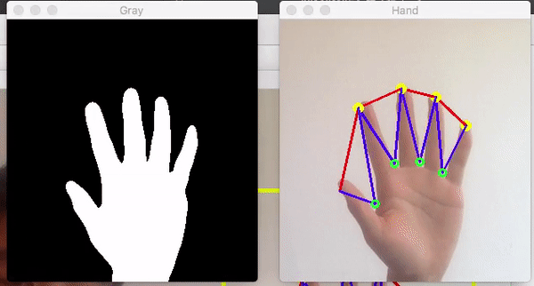
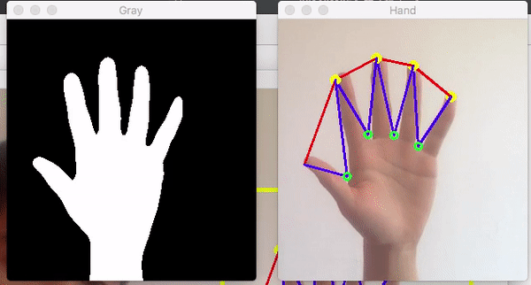

# Palm Live Detection

### Brief

To detect if a palm is __alive__ or is __just a picture__, implementing using OpenCV.

This system is a course project of Digital Image Processing.

brief steps: 

1. Find palm image pixels using OTSU algorithm
2. Find Contour of the pixels
3. Get finger edges
4. Monitoring the relative distance between finger edges.
   1. If changed to a threshold -> ALIVE


### Usage

``` bash
g++ source/hand_reco_lzhbrian.cpp \
-I/path/to/opencv3/include \
-L/path/to/opencv3/lib \
-lopencv_core -lopencv_highgui \
-lopencv_videoio -lopencv_objdetect \
-lopencv_imgproc -lopencv_imgcodecs \
-o hand_reco # To compile

./hand_reco # To run
```


### Demo

* This system detects the relative distance of finger edges, so moving forward or backward won't trigger anything. (as shown below)



* If you stretch your fingers, which results in change of relative distance between finger edges, the system will consider it as a LIVE PALM. (as shown below)

